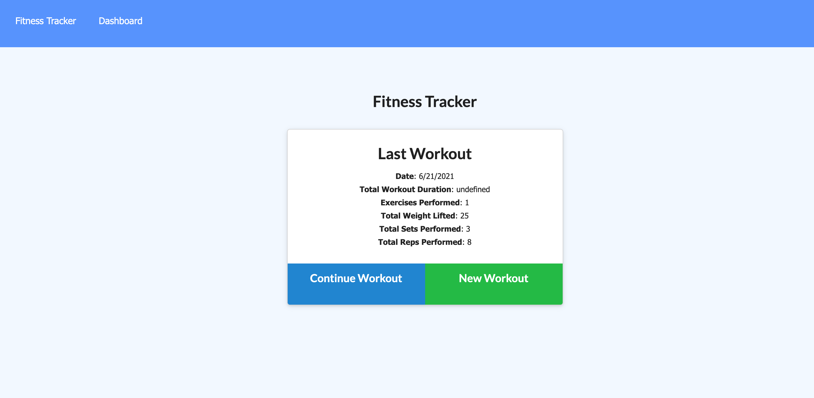
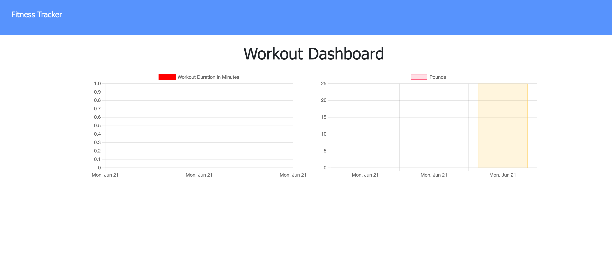

# Workout-tracker

## Links:

Github: https://github.com/Yeatman51

Repository: https://github.com/Yeatman51/workout-tracker

Live Demo: https://workout-tracker-jy.herokuapp.com/

---

## Description:
This application utilizes mongo DB to store user work out information. All of your previous workouts can be logged in this Deployed online site to save and track all of your workouts.

Express, Mongoose, Mongo and JavaScript where all utilized to bring both the front and back end routing and database together for this user driven application

